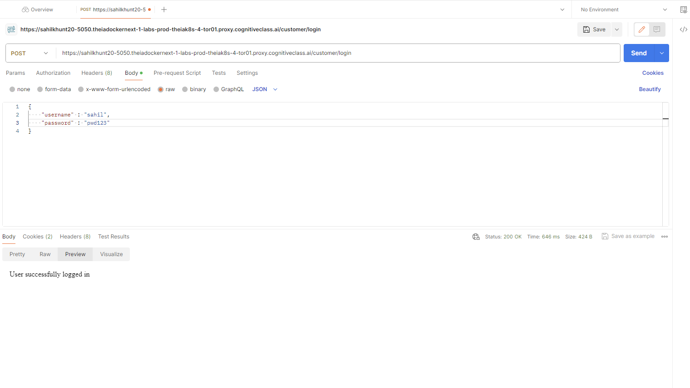

# Project Name

Bookstore Server-Side Application

## Table of Contents
- [Project Overview](#project-overview)
- [Features](#features)
- [Dependencies](#dependencies)
- [Getting Started](#getting-started)
- [Screenshots](#screenshots)
- [Contributing](#contributing)
- [Contact](#contact)

## Project Overview

This project involves the development of a server-side application for an online bookstore. The application is built using Node.js and Express.js and is designed to store, retrieve, and manage book ratings and reviews. The server-side application exposes a RESTful API, allowing communication with a web-based client-side application.

## Features

The server-side application provides the following features and capabilities:

- Retrieve a list of all books available in the bookshop
- Search for specific books and retrieve their details based on ISBN code, author names, and titles
- Retrieve reviews/comments for specified books
- Register as a new user of the application
- Login to the application
- Add a new review for a book (logged-in users only)
- Modify a book review (logged-in users can modify only their own reviews)
- Delete a book review (logged-in users can delete only their own reviews)
- Allow multiple users to access the application simultaneously to view and manage different book reviews

## Dependencies

- `express` - for building the RESTful API
- `mongoose` - for interacting with MongoDB
- `jsonwebtoken` - for JWT authentication
- `bcrypt` - for password hashing
- `express-session` - for session-based authentication
  
## Getting Started

1. Fork and clone the repository.
2. Set up MongoDB and configure the connection in `app.js`.
3. Run `npm install` to install dependencies.
4. Define models in `userModel.js`, `bookModel.js`, and `reviewModel.js`.
5. Implement controllers in `bookController.js`, `userController.js`, and `reviewController.js`.
6. Implement routes in `authRoutes.js`, `bookRoutes.js`, and `reviewRoutes.js`.
7. Implement authentication middleware in `authMiddleware.js`.
8. Implement CRUD operations for books and reviews.
9. Implement session and JWT authentication.
10. Handle concurrent operations using Promises, Callbacks, or Async/Await functions.
11. Test with Postman.

## Screenshots

---

---

---

---

---

---

---

---

## Contributing

If you'd like to contribute to the project, provide guidelines for how others can do so.

1. Fork the project
2. Create your feature branch (`git checkout -b feature/YourFeature`)
3. Commit your changes (`git commit -m 'Add some feature'`)
4. Push to the branch (`git push origin feature/YourFeature`)
5. Open a pull request

## Contact

For questions or feedback, please contact [Sahil Khunt](mailto:sahilkhunt20@gmail.com).
